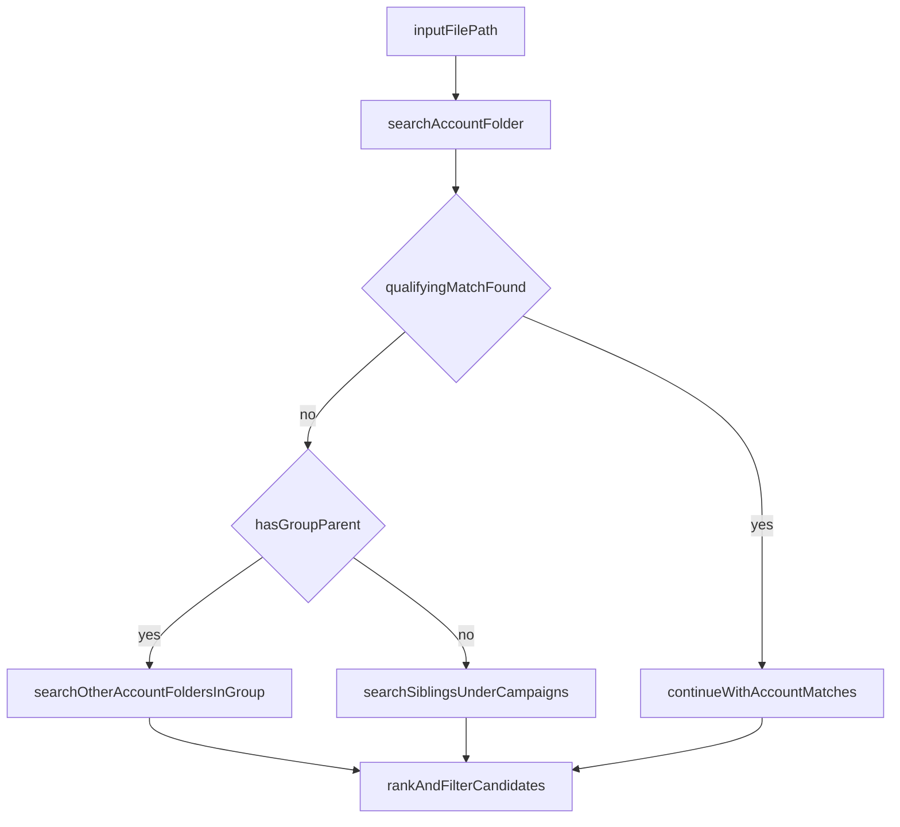

# Hierarchical Similarity Discovery Plan

## Goal
Update candidate file discovery so similarity search follows your path hierarchy rules for testing:
- input path can be relative
- filename pattern: `YYYY-MM-[accountID]-[A-|D-]<id>.xlsx`
- canonical examples to support:
  - `2025-11-rogerbeasleyvolvovcna-A-25008537.xlsx`
  - `2026-06-tonydivinousedcarsntrucks-D-94095.xlsx`
- staged search from lower to higher scope:
  1) same accountID folder first
  2) if no qualifying match found, widen upward (group siblings or Campaigns siblings)
- improve widened-search precision by consulting dealership metadata:
  - account OEM(s) (including multi-OEM or `All`)
  - OEM family (for example, GM Motors / Stellantis / Ford-Lincoln / `NA`)

## Current Gap
Current discovery in [C:/nicole/Brief Tutor/graph/tools.py](C:/nicole/Brief Tutor/graph/tools.py) does a repo-wide `rglob("*.xlsx")` filtered only by filename family slug. It does not use folder hierarchy.

## Target Search Behavior

## Agreed Scope Rules
- **Group case:** search same accountID folder first; if no qualifying match, search other accountID folders in the same group folder.
- **No-group case (account directly under Campaigns):** after same-account search, widen to sibling accountID/group folders under `Campaigns`.
- **Metadata behavior:** during widened search, apply hard OEM/OEM-family compatibility filter first; if no qualifying candidate remains, fallback to broader folder-scope matching.
- **Source of truth:** dealership Group/account/OEM mapping is manually seeded and maintained in Supabase tables.

## Implementation Changes

## Phased Rollout

### Phase 1 — Hierarchy + Parser Unification (Ship first)
- Implement filename parsing for both `A-` and `D-` IDs and reuse it across:
  - similarity discovery flow
  - campaign update route
- Implement staged hierarchical search:
  - account folder first
  - conditional widening to group / Campaigns sibling scope
- Keep current scoring/reporting/Supabase persistence behavior intact.
- Add tests for parser + hierarchy widening rules.

### Phase 2 — Dealership Metadata Accuracy Layer
- Add Supabase metadata tables and manual seed process:
  - `dealership_groups`
  - `dealership_accounts`
  - `dealership_account_oems`
- Add repository lookup/filter helpers for OEM and OEM family.
- Apply widened-search filter strategy:
  - hard OEM/OEM-family filter first
  - fallback to broader search if filter returns no qualifying candidates.
- Add OEM-focused validation tests and docs.

### 1) Path + naming utilities
Update [C:/nicole/Brief Tutor/graph/tools.py](C:/nicole/Brief Tutor/graph/tools.py):
- Add robust parser for target filename pattern supporting both `A-` and `D-` IDs.
- Add path resolver for relative input paths to canonical absolute path (project-safe).
- Add helper to classify folder context:
  - account folder
  - optional group folder
  - Campaigns root detection
- Reuse the same filename parser for both:
  - family similarity discovery flow
  - campaign update route (previous workflow branch) so `A-` and `D-` IDs are handled consistently.

### 2) Hierarchical candidate discovery
Refactor `list_same_family_local_spreadsheets(...)` in [C:/nicole/Brief Tutor/graph/tools.py](C:/nicole/Brief Tutor/graph/tools.py) to:
- Stage 1: search only target account folder scope.
- Evaluate whether qualifying similar campaigns exist (threshold-aware gate).
- Stage 2 (conditional widen):
  - group case: add other account folders in group.
  - no-group case: add sibling account/group folders under Campaigns.
- Keep existing exclusions:
  - skip target file itself
  - ignore blocked/system dirs
  - only `.xlsx`

### 3) Wire staged widening decision
Update [C:/nicole/Brief Tutor/graph/workflow.py](C:/nicole/Brief Tutor/graph/workflow.py) in `family_similarity_analysis_node`:
- Run account-scope candidate pass first.
- Check for qualifying matches using configured threshold (`FAMILY_SIM_STRONG_THRESHOLD` by default).
- Only widen scope when no qualifying result is found.
- Preserve current ranking, narrative enrichment, file outputs, and Supabase persistence.

### 3.5) Dealership metadata database integration
Add/extend Supabase repository + schema to support hierarchy-aware metadata lookups:
- Update [C:/nicole/Brief Tutor/graph/supabase/repository.py](C:/nicole/Brief Tutor/graph/supabase/repository.py):
  - account metadata lookup by accountID (and optional group)
  - OEM/OEM family compatibility helper methods
  - candidate filtering helper for widened search
- Add SQL migration/script for tables (manual seed model):
  - `dealership_groups`
  - `dealership_accounts`
  - `dealership_account_oems` (join table for multi-OEM support)
- Ensure support for special values:
  - `All` OEM handling
  - `NA` OEM family handling

### 4) Pattern + config updates
Update [C:/nicole/Brief Tutor/.env.example](C:/nicole/Brief Tutor/.env.example):
- Add optional discovery controls, e.g.:
  - `FAMILY_SIM_WIDEN_IF_NO_QUALIFYING=true`
  - `FAMILY_SIM_QUALIFYING_THRESHOLD=0.80`
  - `FAMILY_SIM_USE_OEM_FILTER=true`
  - `FAMILY_SIM_OEM_FALLBACK_IF_EMPTY=true`

Update [C:/nicole/Brief Tutor/README.md](C:/nicole/Brief Tutor/README.md):
- Document hierarchical search order and folder assumptions.
- Document `A-`/`D-` filename support.
- Document the two accepted filename examples and clarify parser reuse in campaign update workflows.
- Document dealership Group/account/OEM metadata model and manual seeding workflow.
- Document hard-filter then fallback behavior for widened searches.

## Validation Plan
- Unit tests (new test module under project tests):
  - filename parser accepts `A-` and `D-`
  - filename parser validates both examples:
    - `2025-11-rogerbeasleyvolvovcna-A-25008537.xlsx`
    - `2026-06-tonydivinousedcarsntrucks-D-94095.xlsx`
  - folder-context detection for grouped and non-grouped account paths
  - staged widening trigger logic
  - campaign update route uses the same parser output for accountID + ID token extraction
  - OEM compatibility filter behavior (`same OEM`, `same OEM family`, `All`, `NA`)
- Integration-style test with small fixture tree:
  - account-only match available -> no widening
  - no account qualifying match -> widening occurs correctly by rule
  - widened scope with OEM filter yields narrowed candidates first
  - empty OEM-filter result triggers fallback to broader candidates

## Suggested Delivery Order
- Complete and validate **Phase 1** first, then run live testing with your current folder tree.
- After Phase 1 is stable, implement **Phase 2** with seeded dealership metadata and OEM filtering toggles.

## Risks and Mitigations
- **Ambiguous folder naming:** use explicit parent detection and conservative fallback to account-only with warning.
- **Relative path drift:** resolve to canonical absolute path once, then operate consistently.
- **Performance on wide Campaigns trees:** keep staged narrowing first and widen conditionally only when needed.
- **Metadata quality drift:** enforce unique accountID keys and seed validation checks before enabling OEM filter mode.