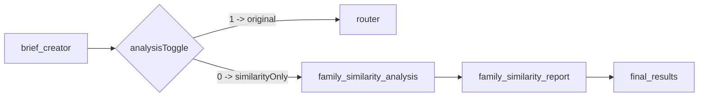

# Toggleable Family Similarity Route Plan

## Goal
Add a new branch in the main workflow that runs immediately after `brief_creator`, controlled by a toggle. If toggle is `"1"`, keep current behavior and continue through the original task-type analyzer route. If toggle is `"0"`, run the family similarity flow (same-family spreadsheet comparisons + report outputs) and then end this execution line without entering campaign diagnosis analysis.

## Proposed Flow

## Implementation Design
- Add an env/config toggle representing analyzer route selection after brief parsing.
  - `"1"`: run original campaign analyzer route (existing router flow).
  - `"0"`: run family-similarity-only route and end.
- Add route logic in the main workflow immediately after `brief_creator`.
- Keep family similarity logic fully separate from task-agent diagnosis generation.
- Parse family/dealership slug from filename using convention `YYYY-MM-<family>-A-<id>.xlsx`.
- Discover candidate spreadsheets locally (project root `.xlsx`) and keep only same-family files excluding the target file.
- Parse each candidate with the same parser path already used by brief creation (`load_and_parse_spreadsheet` internals), so schema consistency is preserved.
- Compute deterministic weighted similarity per campaign pair:
  - `assets` text similarity weight: 0.40
  - `style_descriptions` similarity weight: 0.30
  - `offer_details` similarity weight: 0.30
- Aggregate campaign-pair matches into file-level ranking and split into:
  - strong matches: `>= 80%`
  - human-check matches: `>= 50% and < 80%`
- Persist result JSON in `results/` (or a dedicated `results/similarity/`) for each run.
- Generate a companion `.txt` report document listing:
  1. File Name
  2. Dealership Name and ID
  3. Type of Task
  4. Campaigns most similar (>=80%), ranked desc with percentages
  5. Campaigns for human review (>=50%), ranked desc with percentages

## Data/State Changes
- Extend [C:/nicole/Brief Tutor/graph/models.py](C:/nicole/Brief Tutor/graph/models.py):
  - Add optional `family_similarity` field in `AgentState` for downstream access and traceability.
  - Add small Pydantic models for similarity artifacts (candidate file summary, campaign match, thresholds bucket, final report payload).
- Keep execution stats in `family_similarity` payload (candidate count, parse failures, elapsed time).

## Workflow Wiring
- Update [C:/nicole/Brief Tutor/graph/workflow.py](C:/nicole/Brief Tutor/graph/workflow.py):
  - Register two nodes: `family_similarity_analysis` and `family_similarity_report`.
  - Replace direct `brief_creator -> router` edge with conditional routing on the toggle value.
  - Toggle `"1"` path: unchanged existing route (`router -> task agents -> diagnosis formatter -> document creator`).
  - Toggle `"0"` path: `brief_creator -> family_similarity_analysis -> family_similarity_report -> final_results`.
  - Ensure candidate parsing failures are non-fatal (skip candidate, keep warnings in result payload).

## Tools/Helpers
- Add helper utilities in [C:/nicole/Brief Tutor/graph/tools.py](C:/nicole/Brief Tutor/graph/tools.py):
  - `extract_family_slug_from_filename(path: str) -> str | None`
  - `list_same_family_local_spreadsheets(target_path: str) -> list[str]`
  - `compute_campaign_similarity(target_campaign, candidate_campaign) -> float`
  - `compare_briefs_and_rank(target_brief, candidate_brief) -> structured result`
  - `write_family_similarity_outputs(...)` for JSON + report TXT
- Reuse existing parsing path to avoid divergence and keep one source of truth.

## Persistence Strategy (Now + Future)
- Now: file-based memory in `results/similarity/<target-basename>-family-similarity.json`.
- Future-ready adapter: define a thin repository interface so storage can switch to DB (SQLite/Postgres) without changing node logic.
  - Suggested key: `target_file + matched_file + campaign_pair`.

## Config and Docs
- Update [C:/nicole/Brief Tutor/.env.example](C:/nicole/Brief Tutor/.env.example) with feature gate and optional thresholds/weights:
  - `BRIEF_POST_PARSE_ROUTE=1` (accepted values: `1` original analyzer, `0` similarity-only route)
  - `FAMILY_SIM_STRONG_THRESHOLD=0.80`
  - `FAMILY_SIM_REVIEW_THRESHOLD=0.50`
- Document behavior in [C:/nicole/Brief Tutor/README.md](C:/nicole/Brief Tutor/README.md), including filename convention requirement and mutually exclusive branch behavior after `brief_creator`.

## Validation Plan
- Add unit tests for:
  - filename family extraction and edge cases
  - similarity scoring weights and deterministic output
  - threshold bucket assignment and ranking order
- Add integration test using 2-3 local fixture spreadsheets to confirm:
  - toggle `1` routes `brief_creator -> router` and preserves current analyzer behavior
  - toggle `0` routes to similarity-only nodes and reaches `final_results` without entering router/task analyzer nodes
  - toggle `0` generates JSON + TXT outputs with expected ranking/threshold buckets

## Risks and Mitigations
- Filename convention drift: fall back gracefully and skip stage with warning if family slug cannot be extracted.
- Candidate parse variability: isolate parser errors per file; continue processing others.
- Performance with many files: cap candidates by optional max env value in future (`FAMILY_SIM_MAX_FILES`).