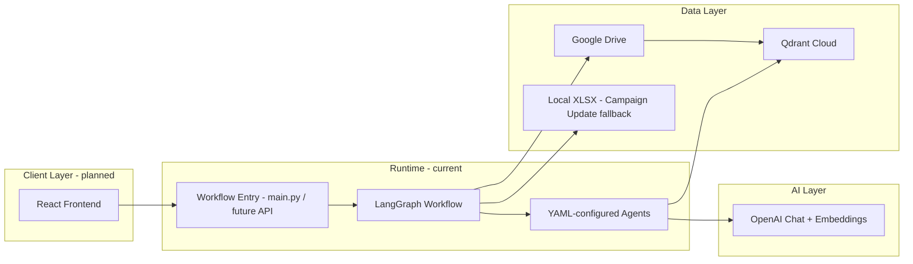

# Brief Tutor — Tech Stack

How the system is built, integrated, and constrained today—with a clear line between **current** (working) choices and **planned** evolution.

---

## Summary

| Layer | Choice |
|-------|--------|
| Language | **Python 3** |
| Orchestration | **LangGraph** + **LangChain** |
| LLM (current) | **OpenAI** (`langchain-openai`) — primary and only provider in use |
| LLM (deferred) | **Vertex AI** (`langchain-google-vertexai`) — present in codebase, not production-ready in current environment |
| Vector DB | **Qdrant Cloud** (`qdrant-client`, `langchain-qdrant`) |
| Documents / briefs source | **Google Drive** (service account) |
| Campaign Update workaround | **Local files** when Drive/Sheets access is blocked |
| Config | **YAML** agent prompts (`agents/*.yaml`), **Pydantic** state (`graph/models.py`) |
| Observability | **LangSmith** (optional, analytics/dev); **JSONL** run metrics (`workflow_metrics.jsonl`) |
| Future UI | **React** calling backend that invokes workflow (today: `main.py` as entrypoint) |
| Deployment (current) | **Local standalone** program |
| Deployment (direction) | **Internal API + React UI** |
| CI | **GitHub Actions** (recommended) |
| Secrets | **`.env` locally**; API keys for service auth |

---

## Application Architecture

### Workflow nodes (reference)

LangGraph pipeline in `graph/workflow.py`, including:

- **brief_creator** — parse/route incoming spreadsheet
- **theme_agent**, **new_creative_agent**, **campaign_update_agent** — task-specific consistency analysis (RAG tools)
- **diagnosis_formatter** — validate and format to Excel template
- **document_creator** — brief resume + full diagnoses listing

Provider routing lives in `graph/llm_provider.py` (OpenAI active; Vertex gated by `ENABLE_VERTEXAI`).

---

## Core Dependencies

From `requirements.txt` (representative):

| Package | Purpose |
|---------|---------|
| `langgraph`, `langchain`, `langchain-core` | Agent graph orchestration |
| `langchain-openai` | Chat + embeddings (active) |
| `langchain-google-vertexai`, `google-cloud-aiplatform` | Vertex path (deferred) |
| `langchain-qdrant`, `qdrant-client` | Vector retrieval |
| `langsmith` | Optional tracing |
| `pydantic` | Typed workflow state |
| `openpyxl`, `pandas` | Spreadsheet read/write |
| `pyyaml` | Agent configuration |
| `pypdf`, `python-docx` | Guideline ingestion |
| `google-api-python-client`, `google-auth*` | Google Drive API |
| `python-dotenv` | Local configuration |

---

## LLM & Embeddings

### Current (production intent)

- **Provider:** OpenAI only (`LLM_PROVIDER=openai`).
- **Chat model:** Configurable via `OPENAI_CHAT_MODEL` / `LLM_MODEL` (default in workflow: `gpt-5-nano` for speed/cost).
- **Embeddings:** `text-embedding-3-large` (3072-dim) unless overridden.
- **Vertex:** Code and env vars exist; **not used** until GCP/Vertex access works in target environment. Keep `ENABLE_VERTEXAI=false` or OpenAI-only routing to avoid silent fallback confusion.

### RAG

- **Store:** Qdrant Cloud (single shared collection per environment).
- **Ingestion:** `rag_ingestion.py` — guidelines (PDF/DOCX) + campaign metadata (XLSX) from Drive folder layout.
- **Retrieval tools:** `retrieve_rag_information`, `retrieve_campaign_briefs`, diagnosis memory utilities in `graph/tools.py`.
- **Grounding:** Outputs should cite retrieved context; eval gates in env (`EVAL_MIN_GROUNDEDNESS`, `EVAL_MIN_FIELD_COMPLETENESS`).

---

## Data & Integrations

| Source | Usage |
|--------|--------|
| **Google Drive** | Guidelines, campaign briefs, diagnosis storage/sync (where API allows) |
| **Local XLSX** | **Campaign Update** when Sheets/Drive access is limited by GCP/service-account constraints |
| **Qdrant** | Shared knowledge base (not per-dealership isolated) |

**Outputs:** Downloadable **`.txt`** files (brief resume + diagnoses listing); Excel-formatted diagnosis artifacts via formatter.

**Corpus maintenance:** Workflow developer operates ingestion/sync (`rag_ingestion.py`, Drive folder conventions per README).

**Not in scope now:** Dropbox, multi-tenant KB, non-Drive brief sources.

---

## Configuration & Versioning

- **Environment:** `.env` (from `.env.example`) — API keys, Qdrant, Drive folder IDs, eval thresholds.
- **Google auth:** Service account JSON in `credentials/`; `GOOGLE_SERVICE_ACCOUNT_FILE`, `GOOGLE_APPLICATION_CREDENTIALS` for Drive (and future Vertex ADC).
- **Agent behavior:** Versioned YAML under `agents/`; prompt changes should be traceable (LangSmith optional; consider tagging prompt versions in releases).

---

## Security & Access (current assumptions)

| Topic | Approach |
|-------|----------|
| Authentication | **API keys** (OpenAI, Qdrant, future UI→backend) |
| Secrets | Local `.env` only for now |
| PII | Not formally classified—treat briefs as internal business data; avoid logging full spreadsheet content in shared traces |
| Human gate | No auto-publish; evaluator review required |

---

## Observability

| Tool | Role |
|------|------|
| **LangSmith** | Optional — run traces, prompt debugging, analytics (`graph/langsmith_workflow.py`) |
| **workflow_metrics.jsonl** | Per-run / per-node latency, grounding and field alerts |
| **Central APM** | Not required initially; LangSmith + JSONL sufficient for dev/pilot |

---

## Deployment Constraints

### Today

- Runs as a **local standalone** Python process (`main.py`).
- No cloud deployment mandate; no multi-region requirement documented.

### Direction (12-month shape)

- **React** frontend → HTTP/API layer → same LangGraph workflow.
- Still **internal** tooling (C&C Grooming), not public internet-facing.
- Continue **Qdrant Cloud** and **Google Drive** unless a blocker forces migration.

### CI/CD

- **GitHub Actions** — lint/test on PR, optional golden-brief workflow smoke test.
- **Unit tests** — planned; focus on parsers, RAG helpers, schema validation, eval gates.

---

## Known Technical Blockers

1. **Vertex AI** — Not operational in current setup; stay on OpenAI until resolved.
2. **Campaign Update sources** — Limited to **local files** when Google Spreadsheets are unreachable under current GCP/Drive permissions.
3. **Source access breadth** — Expanding “similar campaign” retrieval may require Dropbox or richer Drive indexing (deferred).

---

## Environment Variables (reference)

See `.env.example` and README for full list. Critical groups:

- `OPENAI_API_KEY`, `OPENAI_CHAT_MODEL`, `LLM_PROVIDER=openai`
- `QDRANT_URL`, `QDRANT_API_KEY`, `QDRANT_COLLECTION_NAME`
- `GOOGLE_SERVICE_ACCOUNT_FILE`, `GOOGLE_DRIVE_FOLDER_ID`
- `EVAL_MIN_GROUNDEDNESS`, `EVAL_MIN_FIELD_COMPLETENESS`, `WORKFLOW_METRICS_FILE`
- Vertex vars — keep documented but inactive until adoption

---

## Frontend (planned)

| Item | Choice |
|------|--------|
| Framework | **React** |
| Integration | UI triggers full job currently executed via `main.py` (wrap with API server—FastAPI/Flask TBD) |
| UX goals | Upload/select brief, show diagnoses, support verify/edit flow, download `.txt` |

Backend API wrapper is **not yet** a separate package in repo—roadmap item.
