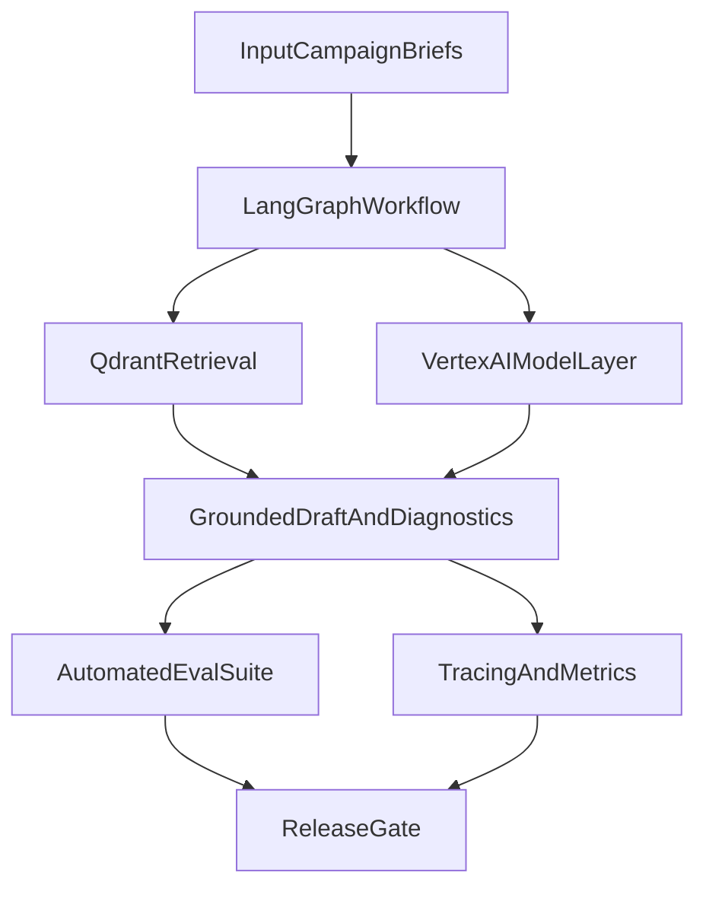

# Vertex AI / Google LLMOps Adoption Plan

## Fit For This Project
- Current architecture already matches LLMOps patterns: orchestrated agents, external tools, retrieval, and structured outputs.
- Existing Google integration (service account + Drive ingestion) lowers setup friction for Vertex AI authentication and governance.
- Selected path: **RAG + grounding first** with a **medium production-ready scope**.
- This aligns directly with the image lane around enterprise data, embeddings/vector search, and grounding.

## Current Baseline (From Repo)
- LangGraph orchestration in [C:/nicole/Brief Tutor/graph/workflow.py](C:/nicole/Brief Tutor/graph/workflow.py).
- Tooling and retrieval logic in [C:/nicole/Brief Tutor/graph/tools.py](C:/nicole/Brief Tutor/graph/tools.py).
- Agent configs in [C:/nicole/Brief Tutor/agents/brief_creator_agent.yaml](C:/nicole/Brief Tutor/agents/brief_creator_agent.yaml).
- Env/dependency entry points in [C:/nicole/Brief Tutor/.env.example](C:/nicole/Brief Tutor/.env.example), [C:/nicole/Brief Tutor/requirements.txt](C:/nicole/Brief Tutor/requirements.txt), and [C:/nicole/Brief Tutor/main.py](C:/nicole/Brief Tutor/main.py).
- README indicates OpenAI + Qdrant + Google Drive ingestion already in use in [C:/nicole/Brief Tutor/README.md](C:/nicole/Brief Tutor/README.md).

## Recommended Rollout (Adjusted To Your Choices)

### Phase 1: Vertex RAG + Grounding (Medium Scope, Production Ready)
- Add Vertex config vars (project, location, model, embeddings model, optional safety settings) while keeping OpenAI as fallback.
- Keep Qdrant as the active vector store for now; do not migrate retrieval backend in this phase.
- Add grounding-aware output checks so each generated recommendation is tied to retrieved context.
- Roll out Vertex generation path to core nodes (`theme_agent`, `new_creative_agent`, `campaign_update_agent`, `qa_agent`) instead of a single-node pilot.
- Add quality/cost/latency comparison logging between fallback and Vertex runs.

### Phase 2: LLMOps Observability (Included In Initial Delivery)
- Add end-to-end tracing for each workflow run (inputs, prompt version, model/version, latency, token/cost estimates, output schema validity).
- Capture per-agent metrics and failure categories (grounding failure, schema mismatch, retrieval miss, policy refusal).
- Define dashboards/alerts for regression triggers (latency spikes, quality score drops, parse failures).

### Phase 3: Evaluation And Guardrails (Lightweight Gate)
- Build a focused eval set from campaign briefs across Theme, New Creative, and Campaign Update.
- Score groundedness and required-field completeness on each candidate release.
- Gate releases when groundedness/field scores regress below threshold.

### Phase 4: Agent Tuning / Training (Deferred)
- After grounding metrics stabilize, evaluate whether supervised tuning or RLHF materially improves output quality.
- Only pursue tuning for failure modes not solved by retrieval quality, prompts, and guardrails.

## Architecture Direction

## Confirmed Decisions
- Scope: **RAG + grounding first**.
- Size: **medium production-ready first phase**.
- Retrieval strategy: keep Qdrant now; revisit Google-native vector backend later only if needed.

## Success Criteria
- Equal or better brief quality versus current outputs.
- No regression in required structured fields.
- Higher groundedness score on generated recommendations.
- Stable latency and cost within agreed budgets.
- Reproducible runs with traceability across model/prompt versions.